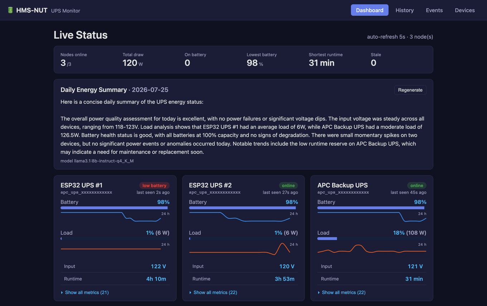
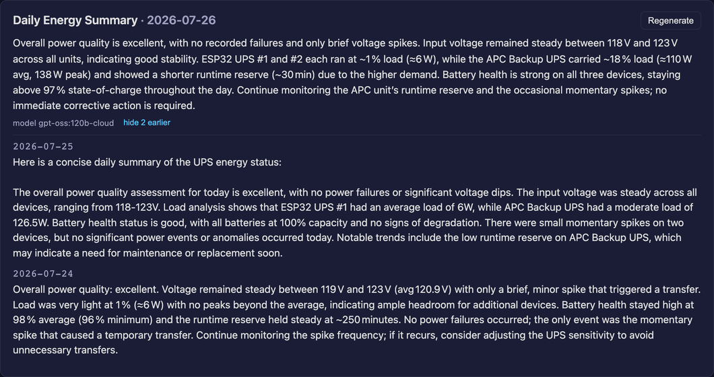
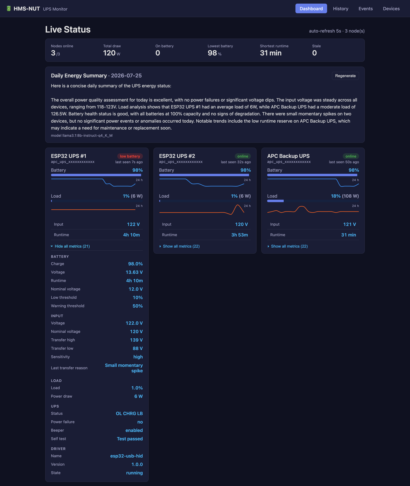
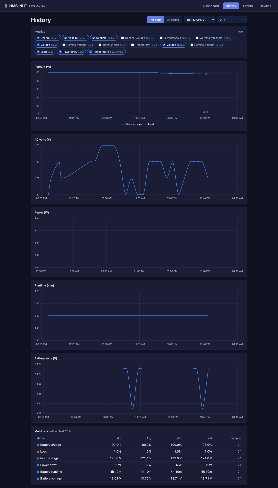
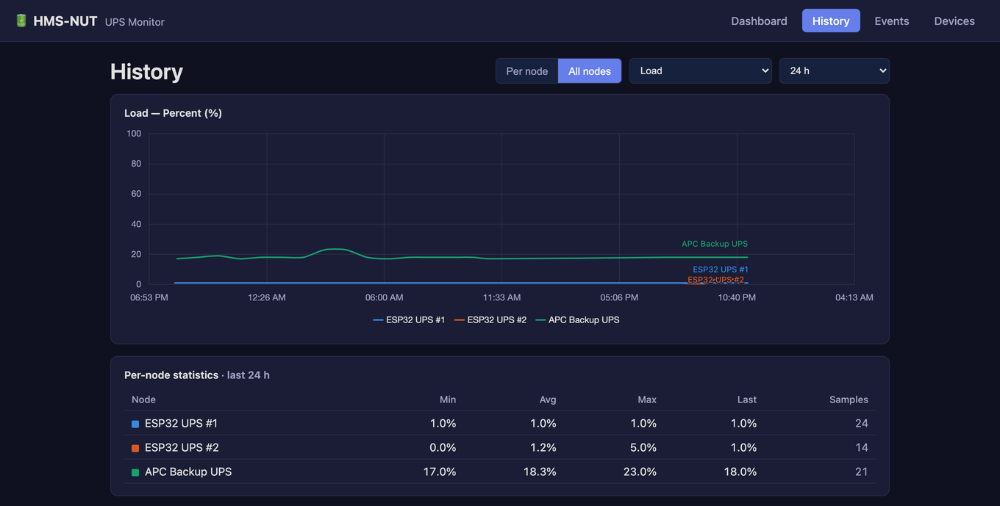
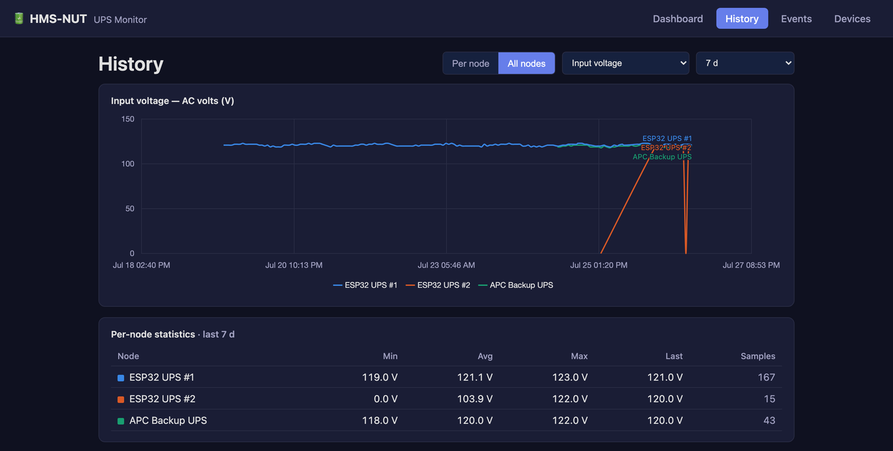
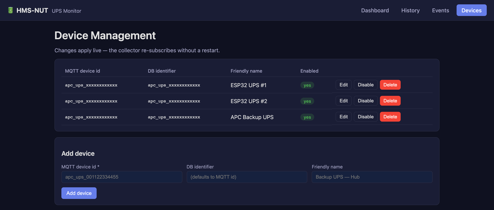

# HMS-NUT

A high-performance C++ microservice for UPS (Uninterruptible Power Supply) monitoring via Network UPS Tools (NUT), with MQTT integration for Home Assistant, PostgreSQL storage for analytics, and a built-in web UI.

[](LICENSE)
[](https://isocpp.org/)
[](https://www.buymeacoffee.com/aamat09)
[](https://github.com/hms-homelab/hms-nut/pkgs/container/hms-nut)
[](https://github.com/hms-homelab/hms-nut/actions)

## Screenshots

> All screenshots are from a live three-node deployment (two ESP32-based UPS monitors and
> one NUT-attached APC unit). Only the MAC-derived device ids are masked.

### Live status

Every configured node at a glance: a fleet roll-up across all of them, the LLM-written daily
energy summary, and per-node battery/load meters with 24-hour trend sparklines and a
last-seen indicator.



### Daily energy summary

With `LLM_ENABLED=true`, the service feeds the previous day's aggregates for every device to
an LLM once a day and writes the result to `ups_daily_summaries`. Summaries are kept, so the
card shows the latest with earlier days behind a toggle, and each records the model that
produced it. The same text is published to MQTT for Home Assistant, and **Regenerate** reruns
any date on demand.



### Every metric the device reports

UPS firmware exposes far more than charge and load. Each card expands into the complete
reported set, grouped by Battery / Input / Output / Load / UPS / Driver / Environment:
nominal and transfer voltages, battery type and manufacture date, self-test result, beeper
state, firmware and driver versions, shutdown and reboot timers.



### History: one node, every metric

Metrics are bucketed by unit family and each family gets its own chart with a single y-axis,
so percentages, AC volts, battery volts, watts, runtime and temperature are never forced onto
a shared scale. Pick any subset; a min/avg/max/last table accompanies the range.



### History: every node on one chart

Switch to *All nodes* to overlay the same metric across the whole fleet, which is how you spot
the one unit that behaved differently.



Any stored metric works, over any range. Here is input voltage across seven days:



### Device management

Add, rename, enable/disable or remove devices from the browser. Changes are persisted and
applied live; the collector re-subscribes its MQTT topics without a service restart.



##What type of nodes can be added?
Regular NUT servers can be added, pick a Linux system, an arm architecture (maybe a rPI connected to your own APC for truly mobile server)
For a minimilistic view checktout  if you own a APC. This will use a single ESP32S3 as a NUT server and will decrypt the HID report from the APC. 30+ entities will be sento to Home Assistant and it can be included as a node here. 

## Features

- **NUT Integration**: Polls Network UPS Tools daemon for real-time UPS metrics
- **MQTT Discovery**: Auto-registers sensors with Home Assistant via MQTT discovery protocol
- **Multi-Device Support**: Monitor multiple UPS devices (NUT + ESP32-based monitors)
- **Web UI**: Angular dashboard served by the service itself: live status, history charts,
  power events and device management, no extra container or reverse proxy
- **Complete Telemetry**: Every field the UPS reports is collected, stored, served and charted
- **Cross-Node Comparison**: Overlay any metric across every monitored UPS on one chart
- **Daily Energy Summary**: Optional LLM-written summary of the previous day's power quality,
  persisted and published to MQTT for Home Assistant
- **PostgreSQL Storage**: Historical data persistence for ML analytics and dashboards
- **Optional NUT Bridge**: Run MQTT-only with `NUT_ENABLED=false` when there is no locally
  attached UPS
- **Low Memory Footprint**: ~3 MB RAM usage
- **Configurable**: All settings via environment variables

## Architecture

```
┌─────────────────┐     ┌─────────────────┐     ┌─────────────────┐
│   NUT Server    │────▶│    HMS-NUT      │────▶│   PostgreSQL    │
│   (upsd)        │     │   C++ Service   │     │   Database      │
└─────────────────┘     └───┬────────┬────┘     └─────────────────┘
                            │        │
   ESP32 UPS monitors ──────┘        ├────────▶ ┌─────────────────┐
   (MQTT, no NUT needed)             │          │  Web UI (SPA)   │
                                     │          │  :8891          │
                                     ▼          └─────────────────┘
                        ┌─────────────────┐     ┌─────────────────┐
                        │   MQTT Broker   │────▶│ Home Assistant  │
                        │   (Mosquitto)   │     │   Dashboard     │
                        └─────────────────┘     └─────────────────┘
```

## Quick Start

### Prerequisites

- C++17 compiler (GCC 9+ or Clang 10+)
- CMake 3.16+
- Network UPS Tools (NUT) server
- PostgreSQL 12+
- MQTT Broker (Mosquitto, EMQX, etc.)

**Required Libraries:**
```bash
# Debian/Ubuntu
sudo apt install libdrogon-dev libjsoncpp-dev libpqxx-dev libpaho-mqttpp3-dev libnut-dev
```

### Build

```bash
git clone https://github.com/hms-homelab/hms-nut.git
cd hms-nut
mkdir build && cd build
cmake ..
make -j$(nproc)
```

### Configure

Copy the example service file and customize:

```bash
cp hms-nut.service.example hms-nut.service
# Edit hms-nut.service with your settings
```

### Install

```bash
sudo cp hms-nut.service /etc/systemd/system/
sudo systemctl daemon-reload
sudo systemctl enable --now hms-nut
```

## Configuration

All configuration is done via environment variables:

### NUT Server Settings

| Variable | Default | Description |
|----------|---------|-------------|
| `NUT_ENABLED` | `true` | Set `false` to run MQTT-only with no NUT bridge |
| `NUT_HOST` | `localhost` | NUT server hostname |
| `NUT_PORT` | `3493` | NUT server port |
| `NUT_UPS_NAME` | `ups@localhost` | UPS name in NUT format |
| `NUT_DEVICE_ID` | `ups` | MQTT device identifier |
| `NUT_DEVICE_NAME` | `UPS` | Human-readable device name |
| `NUT_POLL_INTERVAL` | `60` | Polling interval in seconds |

### Multi-Device Configuration

| Variable | Default | Description |
|----------|---------|-------------|
| `UPS_DEVICE_IDS` | - | Comma-separated MQTT device IDs to collect |
| `UPS_DB_MAPPING` | - | JSON: MQTT ID → DB identifier mapping |
| `UPS_FRIENDLY_NAMES` | - | JSON: MQTT ID → friendly name mapping |

Example for multiple devices:
```bash
UPS_DEVICE_IDS="main_ups,rack_ups,esp32_ups"
UPS_DB_MAPPING='{"main_ups": "apc_smart_ups", "rack_ups": "cyberpower_1500"}'
UPS_FRIENDLY_NAMES='{"main_ups": "Main Server UPS", "rack_ups": "Network Rack UPS"}'
```

### MQTT Settings

| Variable | Default | Description |
|----------|---------|-------------|
| `MQTT_BROKER` | `localhost` | MQTT broker hostname |
| `MQTT_PORT` | `1883` | MQTT broker port |
| `MQTT_USER` | - | MQTT username |
| `MQTT_PASSWORD` | - | MQTT password |
| `MQTT_CLIENT_ID` | `hms_nut_service` | MQTT client identifier |

### Database Settings

| Variable | Default | Description |
|----------|---------|-------------|
| `DB_HOST` | `localhost` | PostgreSQL hostname |
| `DB_PORT` | `5432` | PostgreSQL port |
| `DB_NAME` | `ups_monitoring` | Database name |
| `DB_USER` | - | Database username |
| `DB_PASSWORD` | - | Database password |

### Service Settings

| Variable | Default | Description |
|----------|---------|-------------|
| `COLLECTOR_SAVE_INTERVAL` | `3600` | DB save interval (seconds) |
| `HEALTH_CHECK_PORT` | `8891` | HTTP port for the health check, REST API and web UI |
| `WEB_STATIC_DIR` | `./static` | Directory holding the built web UI |
| `LOG_LEVEL` | `info` | Log level (debug/info/warn/error) |

### Daily Energy Summary (optional)

When enabled, the service queries the previous day's metrics for every device once per day,
asks an LLM to summarise power quality, stores the result in `ups_daily_summaries`, shows it
in the web UI and publishes it to MQTT for Home Assistant.

| Variable | Default | Description |
|----------|---------|-------------|
| `LLM_ENABLED` | `false` | Enable the daily summary |
| `LLM_PROVIDER` | `ollama` | `ollama`, `openai`, `gemini` or `anthropic` |
| `LLM_ENDPOINT` | `http://localhost:11434` | Provider endpoint |
| `LLM_MODEL` | `llama3.1:8b-instruct-q4_K_M` | Model name |
| `LLM_API_KEY` | - | API key (not needed for a local Ollama) |
| `LLM_PROMPT_FILE` | `llm_prompt.txt` | Prompt template; must contain `{metrics}` |
| `SUMMARY_HOUR` | `7` | Hour of day (0-23) to generate the summary |

## Sensors Published

HMS-NUT publishes the following sensors to Home Assistant via MQTT discovery:

**Battery Metrics:**
- Battery charge (%)
- Battery voltage (V)
- Battery runtime (seconds)
- Battery nominal voltage
- Low/warning charge thresholds

**Input Metrics:**
- Input voltage (V)
- Input nominal voltage
- High/low voltage transfer points
- Input sensitivity
- Last transfer reason

**Output & Load:**
- Output voltage (V)
- Load percentage (%)
- Load power (W)
- Nominal power (VA)

**Status:**
- UPS status (online/on battery/etc.)
- Power failure (binary sensor)
- Beeper status
- Self-test result
- Temperature (if available)

## API Endpoints

### Health Check

```bash
curl http://localhost:8891/health
```

Response:
```json
{
  "service": "hms-nut",
  "version": "1.0",
  "status": "healthy",
  "components": {
    "mqtt": "connected",
    "database": "connected",
    "nut_bridge": "running",
    "collector": "running"
  },
  "devices_monitored": 1,
  "last_nut_poll": "2024-01-15T10:30:00Z"
}
```

### Web UI API

```bash
# Configured devices + full live metric snapshot for each
curl http://localhost:8891/api/devices

# History for one node, or several at once (comma-separated).
# Returns { hours, series: [{ device, friendly_name, points: [...] }], ... }
# Every stored numeric column is included in each point.
curl "http://localhost:8891/api/history?device=apc_ups&hours=24"
curl "http://localhost:8891/api/history?device=apc_ups,office_ups&hours=168"

# Recent power events (device optional = all devices)
curl "http://localhost:8891/api/events?limit=50"

# Persisted daily energy summaries, newest first
curl "http://localhost:8891/api/summaries?limit=14"

# Regenerate a summary on demand (defaults to yesterday)
curl -X POST "http://localhost:8891/api/summary?date=2026-07-25"
```

The **History** page has two modes: *Per node* (one node, one chart per unit family) and
*All nodes* (one metric, every node overlaid on a shared axis), both with a min/avg/max
statistics table for the selected range.

## Database Schema

Required PostgreSQL table:

```sql
CREATE TABLE ups_metrics (
    id SERIAL PRIMARY KEY,
    device_identifier VARCHAR(64) NOT NULL,
    timestamp TIMESTAMPTZ NOT NULL DEFAULT NOW(),
    battery_charge DECIMAL(5,2),
    battery_voltage DECIMAL(5,2),
    battery_runtime INTEGER,
    input_voltage DECIMAL(6,2),
    output_voltage DECIMAL(6,2),
    load_percentage DECIMAL(5,2),
    load_watts DECIMAL(8,2),
    ups_status VARCHAR(32),
    temperature DECIMAL(5,2)
);

CREATE INDEX idx_ups_metrics_device_time
ON ups_metrics(device_identifier, timestamp DESC);
```

Two further tables are created automatically at startup if missing, so no manual step is
needed: `device_config` (editable device management, seeded once from the `UPS_*` env vars)
and `ups_daily_summaries` (one row per date, holding the generated energy summary and the
model that produced it, so the UI can show summary history across restarts).

## Running Tests

```bash
cd tests
mkdir build && cd build
cmake ..
make
ctest --output-on-failure
```

## Docker

Build and run with Docker:

```bash
docker build -t hms-nut .
docker run -d \
  -e NUT_HOST=your-nut-server \
  -e MQTT_BROKER=your-mqtt-broker \
  -e DB_HOST=your-postgres \
  -p 8891:8891 \
  hms-nut
```

Or use Docker Compose - see `docker-compose.yml`.

## Directory Structure

```
hms-nut/
├── src/
│   ├── main.cpp              # Application entry point
│   ├── nut/
│   │   ├── NutClient.cpp     # NUT protocol client
│   │   └── UpsData.cpp       # UPS data models
│   ├── services/
│   │   ├── NutBridgeService.cpp   # NUT → MQTT bridge
│   │   └── CollectorService.cpp   # MQTT → PostgreSQL collector
│   ├── database/
│   │   └── DatabaseService.cpp    # PostgreSQL interface
│   ├── mqtt/
│   │   ├── MqttClient.cpp         # MQTT client wrapper
│   │   └── DiscoveryPublisher.cpp # HA discovery messages
│   └── utils/
│       └── DeviceMapper.cpp       # Device ID mapping
├── include/                  # Header files
├── tests/                    # Unit tests
├── CMakeLists.txt
├── Dockerfile
├── docker-compose.yml
├── hms-nut.service.example   # Systemd service template
└── README.md
```

## Contributing

1. Fork the repository
2. Create a feature branch (`git checkout -b feature/amazing-feature`)
3. Commit your changes (`git commit -m 'Add amazing feature'`)
4. Push to the branch (`git push origin feature/amazing-feature`)
5. Open a Pull Request
---

## ☕ Support

If this project is useful to you, consider buying me a coffee!

[](https://www.buymeacoffee.com/aamat09)

## License

This project is licensed under the MIT License - see the [LICENSE](LICENSE) file for details.

## Related Projects

- [Network UPS Tools (NUT)](https://networkupstools.org/)
- [Home Assistant](https://www.home-assistant.io/)
- [Drogon C++ Framework](https://github.com/drogonframework/drogon)

## Acknowledgments

Part of the [HMS Homelab](https://github.com/hms-homelab) project - lightweight C++ microservices for home automation.
